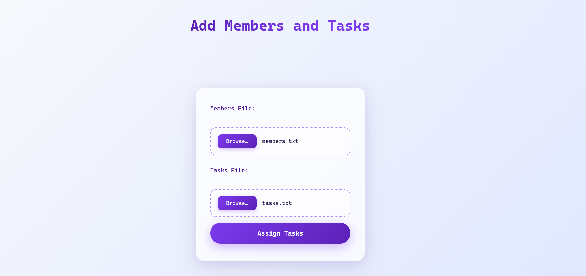
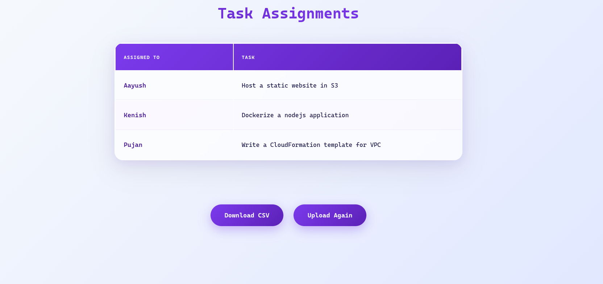

# randmetask : Randomly Assign Tasks To Team Members

This application takes two files as input i.e members.txt and tasks.txt and assigns task to members randomly.

---

## Running The Application

1. **Pull docker image**
```bash
docker pull amitgiri13/randmetask:1.0.0
```
---

2. **Run the container**
```bash
docker run --name randmetask -p 80:8000 -d amitgiri13/randmetask:1.0.0
```
---

3. **Input files**

- members.txt
```bash
member-1
member-2
member-3
```
---

- tasks.txt
```bash
task-1
task-2
task-3
```
---

4. **Using the application**

- Upload members.txt and tasks.txt



---

- View the result



---

## Contributions

Contributions are always welcome!
If you have ideas to improve this project, feel free to fork the repository, make your changes, and open a pull request. Bug fixes, enhancements, new features, and documentation updates are all appreciated.

---